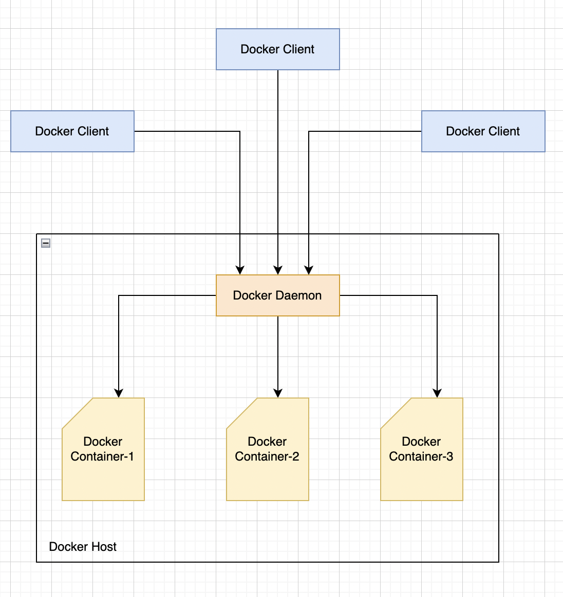

# Docker

### Docker Components:
1. Docker Engine (Docker client and server)
2. Docker Images
3. Registries
4. Docker Containers

### Docker client and server
1. The docker client talks to the docker server or daemon, which, in turn, does all the work.
2. Docker daemon is sometimes called the Docker Engine.
3. Docker ships with a CLI/REST to interact with daemon.

### Docker architecture

### Docker images - Basic Intro
1. Images are the building blocks of the Docker world.
2. You launch your containers from images.
3. You can consider images to be the source code for your containers.
4. They are highly portable and can be shared, stored and updated

### Registries
1. Docker stores the images you build in registries.
2. There are two type of registries: *private* and *public*.
3. Docker Inc. operates the public registry for images called the **Docker Hub**.
4. You can create an account on the Docker Hub and use it to share and store your own images.
5. Different registries are available with different access rights.

### Containers
1. Docker helps you build and deploy containers inside which you can package your applications and services.
2. A Docker container is:
      • An image format.
      • A set of standard operations. 
      • An execution environment.

### Compose and Swarm
The Docker ecosystem contains two more tools:
1. **Docker Compose** - which allows you to run stacks of containers to represent application stacks, for example web server, application server and database server containers running together to serve a specific application.
2. **Docker Swarm** - which allows you to create clusters of containers, called swarms, that allow you to run scalable workloads.

### Container naming
1. Docker will automatically generate a name at random for each container we create.
2. We can specify manual name using --name flag (refer docker-commands.sh)
3. Names are unique. If we try to create two containers with the same name, the command will fail.
4. As soon as come out of this containers, they are stopped.
5. To run containers in background, daemonized containers are used, by using -d flag.

### Building our own Docker Images
1. There are two ways to create a docker image:

      a. via docker commit command (not recommended)

      b. via docker build command with a Dockerfile
2. The Dockerfile uses a basic DSL with instructions for building Docker images.
3. We then use the docker build command to build a new image from the instructions in the Dockerfile.

# Kubernetes
- Release was announced by google in 2014.
- Also known as Kates or K8s.
- It's a container orchestrator.
- Kubernetes makes decisions about where and how containerized applications are launched on a server, when to scale up or down the number of application replicas, and what to do when an application or server stops working.
- An open source project written in Go.
- It can run on any type of server, on-premise, public cloud or hybrid.
- You can kubernetes on your own or can use managed service provided by clouds like google, amazon, microsoft, etc.
- You can use minikube(free tool) to learn kubernetes on your local, but it is not recommended to be used in production.
- we use yaml files to store kubernetes cluster config files in git versioning tools, we call them as kubernetes manifest.

### Minikube (Mac commands)
- start minikube cluster - minikube start
- stop minikube cluster - minikube stop
- delete minikube - minikube delete
- helps you create kubernetes cluster from scratch

### Kubectl (Kube control)
- helps to interact with cluster created by minikube

### Kubernetes namespace
- They let you isolate and organize your workloads.
- When you use kubernetes, you probably would like to use different namespaces to organize your applications and microservices.
- For example, you can separate your environments like prod and qa by creating different namespaces.

### Deploy an application
- Pods are the kubernetes resource that run our applications and microservices.
- One way to ensure that your applications are highly available is to organize your Pods using a kubernetes deployment.
- You can deploy an application from kubernetes manifest, eg - deployment.yaml by running kubectl apply -f deployment.yaml.

### Check Pod health
- 